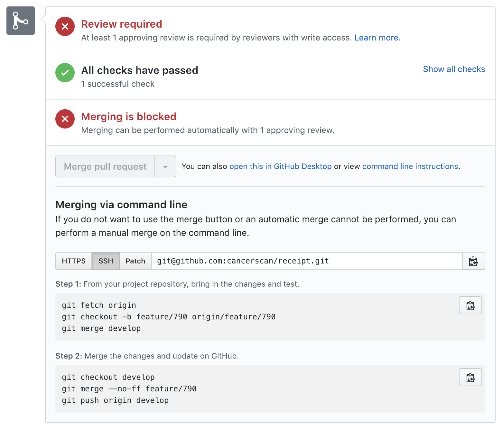

# Git

# add, commit, reset 

## git status

Working Directoryの状態の確認する
 


```{sh, eval=F}
# 準備
cd path/to/workspace
mkdir repo000
cd repo000
```

```{sh, eval=F}
git status 
```

## git init 

カレントディレクトリをgit repositoryにする

```{sh, eval=F}
git init 
```

SourceTreeで開く

## git initをなかったことにする

```{sh, eval=F}
rm -R .git
```


## git add

ファイルをWorking Directoryに追加する.

- 新規ファイルの場合
  - tracked(gitの追跡対象指定)にする
  - staged(commitに含める対象指定)にする.
- 既存ファイルの場合
  - staged(commitに含める対象指定)にする.

`git add [path ...]`

```{sh, eval=F}
echo "ROW000" > file000
git add file000
```

## git addをなかったことにする

- 新規ファイルの場合
  - untracked(gitの追跡対象外)にする
  - unstaged(commitに含める対象外)にする.
- 既存ファイルの場合
  - unstaged(commitに含める対象外)にする.

`git reset [--soft | --hard] [<commit>] [path ...]`

```{sh, eval=F}
git reset HEAD file000
```

stage(git add)されたすべてのファイルを対象にしたい場合

```{sh, eval=F}
git reset HEAD
```

## git commit 

staged(git add)されたすべてのファイルのコピーをGit Directoryへ記録する

```{sh, eval=F}
# 準備
git add file000
```

`git commit [--amend] [-m <msg>]` 

```{sh, eval=F}
git commit -m "Added file000."
```

## git commitをなかったことにする

Git Directoryから最後のCommitを削除する

```{sh, eval=F}
# 準備
cp file000 file001
git add file001
git commit -m "Added file001."
```

```{sh, eval=F}
git reset --soft HEAD^ # HEAD^ = 1つ前の親Commit
```

addもなかったことに

```{sh, eval=F}
# 復習
git reset HEAD 
```

commitとaddの2つをまとめてなかったことに

```{sh, eval=F}
git reset HEAD^ 
```

## git commitをなかったことにしたのをなかったことに

```{sh, eval=F}
$ git reflog
e170b24 (HEAD -> master) HEAD@{0}: reset: moving to HEAD^
953913d HEAD@{1}: commit: Added file001. <-- resetするまえのHEADの位置
...
```

```{sh, eval=F}
git reset HEAD@{1} # HEAD@{1} = 1つ前にHEADの指していたcommit
```

## git reset {.smaller}

<iframe src="https://www.slideshare.net/slideshow/embed_code/key/3BCgttHAboVzqg?startSlide=30" width="595" height="485" frameborder="0" marginwidth="0" marginheight="0" scrolling="no" style="border:1px solid #CCC; border-width:1px; margin-bottom:5px; max-width: 100%;" allowfullscreen> </iframe> <div style="margin-bottom:5px"> <strong> <a href="https://www.slideshare.net/TomohikoHimura/git-22237343" title="やりなおせる Git 入門" target="_blank">やりなおせる Git 入門</a> </strong> from <strong><a href="https://www.slideshare.net/TomohikoHimura" target="_blank">Tomohiko Himura</a></strong> </div>

## {.smaller}

<table class="tableblock frame-all grid-all spread">
<colgroup>
<col style="width: 42.8571%;">
<col style="width: 14.2857%;">
<col style="width: 14.2857%;">
<col style="width: 14.2857%;">
<col style="width: 14.2858%;">
</colgroup>
<thead>
<tr>
<th class="tableblock halign-left valign-top"></th>
<th class="tableblock halign-left valign-top">HEAD</th>
<th class="tableblock halign-left valign-top">インデックス</th>
<th class="tableblock halign-left valign-top">作業ディレクトリ</th>
<th class="tableblock halign-left valign-top">作業ディレクトリ保護の有無</th>
</tr>
</thead>
<tbody>
<tr>
<td class="tableblock halign-left valign-top"><p class="tableblock"><strong>Commit Level</strong></p></td>
<td class="tableblock halign-left valign-top"></td>
<td class="tableblock halign-left valign-top"></td>
<td class="tableblock halign-left valign-top"></td>
<td class="tableblock halign-left valign-top"></td>
</tr>
<tr>
<td class="tableblock halign-left valign-top"><p class="tableblock"><code>reset --soft [commit]</code></p></td>
<td class="tableblock halign-left valign-top"><p class="tableblock">REF</p></td>
<td class="tableblock halign-left valign-top"><p class="tableblock">いいえ</p></td>
<td class="tableblock halign-left valign-top"><p class="tableblock">いいえ</p></td>
<td class="tableblock halign-left valign-top"><p class="tableblock">はい</p></td>
</tr>
<tr>
<td class="tableblock halign-left valign-top"><p class="tableblock"><code>reset [commit]</code></p></td>
<td class="tableblock halign-left valign-top"><p class="tableblock">REF</p></td>
<td class="tableblock halign-left valign-top"><p class="tableblock">はい</p></td>
<td class="tableblock halign-left valign-top"><p class="tableblock">いいえ</p></td>
<td class="tableblock halign-left valign-top"><p class="tableblock">はい</p></td>
</tr>
<tr>
<td class="tableblock halign-left valign-top"><p class="tableblock"><code>reset --hard [commit]</code></p></td>
<td class="tableblock halign-left valign-top"><p class="tableblock">REF</p></td>
<td class="tableblock halign-left valign-top"><p class="tableblock">はい</p></td>
<td class="tableblock halign-left valign-top"><p class="tableblock">はい</p></td>
<td class="tableblock halign-left valign-top"><p class="tableblock"><strong>いいえ</strong></p></td>
</tr>
<tr>
<td class="tableblock halign-left valign-top"><p class="tableblock"><code>checkout [commit]</code></p></td>
<td class="tableblock halign-left valign-top"><p class="tableblock">HEAD</p></td>
<td class="tableblock halign-left valign-top"><p class="tableblock">はい</p></td>
<td class="tableblock halign-left valign-top"><p class="tableblock">はい</p></td>
<td class="tableblock halign-left valign-top"><p class="tableblock">はい</p></td>
</tr>
<tr>
<td class="tableblock halign-left valign-top"><p class="tableblock"><strong>File Level</strong></p></td>
<td class="tableblock halign-left valign-top"></td>
<td class="tableblock halign-left valign-top"></td>
<td class="tableblock halign-left valign-top"></td>
<td class="tableblock halign-left valign-top"></td>
</tr>
<tr>
<td class="tableblock halign-left valign-top"><p class="tableblock"><code>reset (commit) [file]</code></p></td>
<td class="tableblock halign-left valign-top"><p class="tableblock">いいえ</p></td>
<td class="tableblock halign-left valign-top"><p class="tableblock">はい</p></td>
<td class="tableblock halign-left valign-top"><p class="tableblock">いいえ</p></td>
<td class="tableblock halign-left valign-top"><p class="tableblock">はい</p></td>
</tr>
<tr>
<td class="tableblock halign-left valign-top"><p class="tableblock"><code>checkout (commit) [file]</code></p></td>
<td class="tableblock halign-left valign-top"><p class="tableblock">いいえ</p></td>
<td class="tableblock halign-left valign-top"><p class="tableblock">はい</p></td>
<td class="tableblock halign-left valign-top"><p class="tableblock">はい</p></td>
<td class="tableblock halign-left valign-top"><p class="tableblock"><strong>いいえ</strong></p></td>
</tr>
</tbody>
</table>

# rm, mv 

## git rm --cached

ファイルをuntracked(gitの追跡対象外)にする.


`git rm [--cached] [path ...]`

```{sh, eval=F}
cd path/to/workspace
mkdir repo002
echo "ROW000" > file000
git add file000 
git commit -m "Added file000."
```

```{sh, eval=F}
# 復習
git add file000 # tracked(gitの追跡対象指定)にする
```

```{sh, eval=F}
git rm --cached file000
```

## git rm

ファイルをWorking Directoryから削除する.


```{sh, eval=F}
# 準備  
git add file000
```

```{sh, eval=F}
rm file000
git add file000 # git rm --cached file000でも良い
git commit -m "Removed file000."
```

上の2つをまとめてやる

```{sh, eval=F}
# 準備  
git reset --hard HEAD^ # HEAD^ = 1つ前の親Commit
```

```{sh, eval=F}
git rm file000
git commit -m "Removed file000."
```

## git mv

ファイルをmoveまたはrenameする.

*Note: mvとrenameは本質的に同じ*

`git mv  <source> <destination>`

```{sh, eval=F}
# 準備  
git reset --hard HEAD^
```


```{sh, eval=F}
git mv file000 file001
git commit -m "Renamed file000 to file001."
```

# commit --amend, rebase 

## git commitをやり直す

Git Directoryの最後のCommitを変更する

```{sh, eval=F}
# 準備
cd path/to/workspace
mkdir repo003
echo "ROW000" > file000
cp file000 file001
git add file000
git commit -m "Added file000."
```

ファイルをaddし忘れた

```{sh, eval=F}
git add file001 
git commit --amend -m "Added file000 and file001."
```

## git rebase {.smaller}

`git rebase -i <commit>`

Git Direcotryの複数のコミットをまとめて変更する

```{sh, eval=F}
# 復習
git commit --amend # 直前のcommitをやり直す
```

直前だけじゃなく,もっと前まで遡って自分の都合の良いように歴史を改変したい

```{sh, eval=F}
# 準備
for f in file001 file002 file003 gomi; do echo $f; done 
# file001, file002, file003, gomiができれば何でも良い
git add file001
git commit -m "Added file001."
git add file002
git commit -m "Added file002."
git add file003
git commit -m "再帰で検索して「もしかして：再帰」をクリックすると…。"
git add gomi 
git commit -m "Added gomi."
```

```{sh, eval=F}
git rebase -i HEAD~4 # HEAD~4 = 4つ前の親Commit
```

## {.smaller}

```{sh, eval=F}
pick 17b9da7 Added file001.
pick 98ee317 Added file002.
pick 9a7d9db 再帰で検索して「もしかして：再帰」をクリックすると…。
pick 00805cf Added gomi.

# Rebase e170b24..00805cf onto e170b24 (4 commands)
#
# Commands:
# p, pick = use commit
# r, reword = use commit, but edit the commit message
# e, edit = use commit, but stop for amending
# s, squash = use commit, but meld into previous commit
# f, fixup = like "squash", but discard this commit's log message
# x, exec = run command (the rest of the line) using shell
# d, drop = remove commit
#
# These lines can be re-ordered; they are executed from top to bottom.
#
# If you remove a line here THAT COMMIT WILL BE LOST.
#
# However, if you remove everything, the rebase will be aborted.
#
# Note that empty commits are commented out
```
1番目と2番目はまとめたいくて,3番目のメッセージを書き直したくて,4番目は消したい.

## {.smaller}

```{sh, eval=F}
pick 17b9da7 Added file001.
s 98ee317 Added file002.  
e 9a7d9db 再帰で検索して「もしかして：再帰」をクリックすると…。
d 00805cf Added gomi. 

# Rebase e170b24..00805cf onto e170b24 (4 commands)
#
# Commands:
# p, pick = use commit
# r, reword = use commit, but edit the commit message
# e, edit = use commit, but stop for amending
# s, squash = use commit, but meld into previous commit
# f, fixup = like "squash", but discard this commit's log message
# x, exec = run command (the rest of the line) using shell
# d, drop = remove commit
#
# These lines can be re-ordered; they are executed from top to bottom.
#
# If you remove a line here THAT COMMIT WILL BE LOST.
#
# However, if you remove everything, the rebase will be aborted.
#
# Note that empty commits are commented out
```

## {.smaller}

```{sh, eval=F}
# This is a combination of 2 commits.
# This is the 1st commit message:

Added file001.

# This is the commit message #2:

Added file002.

# Please enter the commit message for your changes. Lines starting
# with '#' will be ignored, and an empty message aborts the commit.
#
# Date:      Sat Feb 16 22:50:41 2019 +0900
#
# interactive rebase in progress; onto e170b24
# Last commands done (2 commands done):
#    pick 5b6d77f Added file001.
#    squash 21c25a0 Added file002.
# Next commands to do (2 remaining commands):
#    edit 2f734eb 再帰で検索して「もしかして：再帰」をクリックすると…。
#    drop cf942f2 Added gomi.
# You are currently rebasing branch 'master' on 'e170b24'.
#
# Changes to be committed:
#       new file:   file001
#       new file:   file002
```

## {.smaller}

```{sh, eval=F}
# This is a combination of 2 commits.
# This is the 1st commit message:

Added file001 and file002.

# This is the commit message #2:

# Added file002.

# Please enter the commit message for your changes. Lines starting
# with '#' will be ignored, and an empty message aborts the commit.
#
# Date:      Sat Feb 16 22:50:41 2019 +0900
#
# interactive rebase in progress; onto e170b24
# Last commands done (2 commands done):
#    pick 5b6d77f Added file001.
#    squash 21c25a0 Added file002.
# Next commands to do (2 remaining commands):
#    edit 2f734eb 再帰で検索して「もしかして：再帰」をクリックすると…。
#    drop cf942f2 Added gomi.
# You are currently rebasing branch 'master' on 'e170b24'.
#
# Changes to be committed:
#       new file:   file001
#       new file:   file002
```

## {.smaller}

```{sh, eval=F}
[detached HEAD 0136ee2] Added file001 and file002.
 Date: Sat Feb 16 22:50:41 2019 +0900
 2 files changed, 2 insertions(+)
 create mode 100644 file001
 create mode 100644 file002
Stopped at 2f734eb...  再帰で検索して「もしかして：再帰」をクリックすると…。
You can amend the commit now, with

  git commit --amend

Once you are satisfied with your changes, run

  git rebase --continue
```

```{sh, eval=F}
git commit --amend
```

## {.smaller}

```{sh, eval=F}
再帰で検索して「もしかして：再帰」をクリックすると…。

# Please enter the commit message for your changes. Lines starting
# with '#' will be ignored, and an empty message aborts the commit.
#
# Date:      Sat Feb 16 22:50:41 2019 +0900
#
# interactive rebase in progress; onto e170b24
# Last commands done (3 commands done):
#    squash 21c25a0 Added file002.
#    edit 2f734eb 再帰で検索して「もしかして：再帰」をクリックすると…。
# Next command to do (1 remaining command):
#    drop cf942f2 Added gomi.
# You are currently editing a commit while rebasing branch 'master' on 'e170b24'.
#
# Changes to be committed:
#       new file:   file003
#
```

## {.smaller}

```{sh, eval=F}
Added file003.

# Please enter the commit message for your changes. Lines starting
# with '#' will be ignored, and an empty message aborts the commit.
#
# Date:      Sat Feb 16 22:50:41 2019 +0900
#
# interactive rebase in progress; onto e170b24
# Last commands done (3 commands done):
#    squash 21c25a0 Added file002.
#    edit 2f734eb 再帰で検索して「もしかして：再帰」をクリックすると…。
# Next command to do (1 remaining command):
#    drop cf942f2 Added gomi.
# You are currently editing a commit while rebasing branch 'master' on 'e170b24'.
#
# Changes to be committed:
#       new file:   file003
#
```

```{sh, eval=F}
git rebase --continue
```


## git rebaseをなかったことにする {.smaller}

rebaseの途中でやっぱりやめたくなった
```{sh, eval=F}
git rebase --abort
```

rebaseしたあと,やっぱりなかったことにしたくなった 

```{sh, eval=F}
$ git reflog
a264b19 (HEAD -> master) HEAD@{0}: rebase -i (finish): returning to refs/heads/master
a264b19 (HEAD -> master) HEAD@{1}: commit (amend): Added file003.
ecc3571 HEAD@{2}: rebase -i (edit): 再帰で検索して「もしかして：再帰」をクリックすると…。
9070db1 HEAD@{3}: rebase -i (squash): Added file001 and file002.
408797f HEAD@{4}: rebase -i (start): checkout HEAD~4
92b7c29 HEAD@{5}: commit: Added gomi.  # <-- rebase前のHEADの位置
...
```

```{sh, eval=F}
git reset --hard HEAD@{5} # HEAD@{5} = 5つ前にHEADの指していたcommit
```

## git rebaseをなかったことにしたのをなかったことにする {.smaller}

```{sh, eval=F}
$ git reflog
92b7c29 (HEAD -> master) HEAD@{0}: reset: moving to HEAD@{5} # <-- さっきのreset
a264b19 (HEAD -> master) HEAD@{1}: rebase -i (finish): returning to refs/heads/master
a264b19 (HEAD -> master) HEAD@{2}: commit (amend): Added file003.
ecc3571 HEAD@{3}: rebase -i (edit): 再帰で検索して「もしかして：再帰」をクリックすると…。
9070db1 HEAD@{4}: rebase -i (squash): Added file001 and file002.
408797f HEAD@{5}: rebase -i (start): checkout HEAD~4
92b7c29 HEAD@{6}: commit: Added gomi. 
...
```

```{sh, eval=F}
git reset --hard HEAD@{1} 
```

# branch 

## git branch

```{sh, eval=F}
# 準備
cd path/to/workspace
git init
echo "ROW000" > file000
git add file000 
git commit -m "Added file000."
```

`git branch [-d|-D] <branch-name> [<start-point>]`


```{sh, eval=F}
git branch feature/update_file000 master
```

feature/branch000という名前のタグを作る(指す先はmasterの指しているところ)

## git branchをなかったことにする(branchを削除する)

```{sh, eval=F}
git branch -d feature/update_file000
```

強制的に削除する場合
```{sh, eval=F}
git branch -D feature/update_file000
```

## branchの削除をなかったことにする {.smaller}

```{sh, eval=F}
$ git branch -d feature/update_file000
Deleted branch feature/update_file000 (was e170b24). # <-- ここのhashを覚えておく 
```

```{sh, eval=F}
git checkout e170b24 
git checkout -b feature/update_file000
```

## git checkout

`git checkout [-b] [<branch>|<commit>]`


```{sh, eval=F}
git checkout feature/update_file000
```

HEADの指す先をfeature/branch000へ変える

branchの作成とcheckoutをいっぺんにやる

```{sh, eval=F}
git checkout -b feature/update_file000
```

## {.smaller}

```{sh, eval=F}
git branch testing 
```


```{sh, eval=F}
git checkout testing 
```


## {.smaller}

CLIで見てみる

```{sh, eval=F}
$ git branch feature/update_file000
$ git log --graph --all
* commit e170b24890ca2685d9414b15f3862a28b16b3828 (HEAD -> master, feature/branch000)
  Author: ameono <4m3on0@gmail.com>
  Date:   Sat Feb 16 21:28:33 2019 +0900

      Added file000.
```

```{sh, eval=F}
$ git checkout feature/update_file000
$ git log --graph --all
* commit e170b24890ca2685d9414b15f3862a28b16b3828 (HEAD -> feature/branch000, master)
  Author: ameono <4m3on0@gmail.com>
  Date:   Sat Feb 16 21:28:33 2019 +0900

      Added file000.
```
HEAD -> の指す先に注目.


## {.smaller}

```{sh, eval=F}
echo "ROW001" >> file000
git add file000 
git commit -m "Updated file000 (added the second row)." 
```

masterと違うCommitを指していることを確認
```{sh, eval=F}
git log --oneline --graph --all
```

```{sh, eval=F}
git checkout master
cat file000 # update_file000ブランチの変更が反映されていないことを確認 
cp file000 file001 
git add file001
git commit -m "Added file001."
```

分岐したことを確認
```{sh, eval=F}
git log --oneline --graph --all
```

## git merge {.smaller}




## {.smaller}

```{sh, eval=F}
git checkout feature/update_file000
git merge master 
```

```{sh, eval=F}
$ git log --oneline --graph --all
*   0b45d32 (HEAD -> feature/update_file000) Merge branch 'master' into feature/update_file000
|\
| * 179a3bc (master) Added file001.
* | cf7cb13 Updated file000 (added the second row).
|/
* e170b24 Added file000.
```

## {.smaller}

```{sh, eval=F}
git checkout master 
git merge --no-ff feature/update_file000
```

```{sh, eval=F}
$ git log --oneline --graph --all
*   500adbb (HEAD -> master) Merge branch 'feature/update_file000'
|\
| *   0b45d32 (feature/update_file000) Merge branch 'master' into feature/update_file000
| |\
| |/
|/|
* | 179a3bc Added file001.
| * cf7cb13 Updated file000 (added the second row).
|/
* e170b24 Added file000.
```

## git mergeをなかったことにする {.smaller}

```{sh, eval=F}
$ git log --oneline --graph --all
*   500adbb (HEAD -> master) Merge branch 'feature/update_file000'
|\
| *   0b45d32 (feature/update_file000) Merge branch 'master' into feature/update_file000
| |\
| |/
|/|
* | 179a3bc Added file001. # <-- Merge前のmaterの位置
| * cf7cb13 Updated file000 (added the second row). # <-- Merge前のfeature/update_file000の位置
|/
* e170b24 Added file000.
```

master tagとupdate_file000 tagをそれぞれMerge前の位置に戻せば良い.

## (Interruption) HEADについて {.smaller}

(復習) HEAD^ = 1つ前の親Commit

親が2つ以上ある場合 `HEAD^N (N=親の番号)` のように指定できる.

```{sh, eval=F}
$ git show --name-only HEAD^
commit 179a3bce92c28cb9a6ac1ef4d8ff4002c83d2f7d
Author: ameono <4m3on0@gmail.com>
Date:   Sun Feb 17 00:57:33 2019 +0900

    Added file001.

$ git show --name-only HEAD^2
commit 0b45d32e5332152a5a44400d6394344199f4f968 (feature/update_file000)
Merge: cf7cb13 179a3bc
Author: ameono <4m3on0@gmail.com>
Date:   Sun Feb 17 14:51:11 2019 +0900

    Merge branch 'master' into feature/update_file000
```

## {.smaller}

HEAD~2と似てるけど,全然意味が違う.

```{sh, eval=F}
$ git show --name-only HEAD~2
commit e170b24890ca2685d9414b15f3862a28b16b3828
Author: ameono <4m3on0@gmail.com>
Date:   Sat Feb 16 21:28:33 2019 +0900

    Added file000.
```


- HEAD~N = HEADのN個前の親Commit

- HEAD^N = HEADの1個前の親CommitのN番目

ex) 1個前の親の2番めの親Commit = HEAD~1^2

- HEAD@{N} = N個前にHEADが指していたCommit

## git mergeをなかったことにする (続き) {.smaller}

masterのMergeをなかったことに

```{sh, eval=F}
git reset --hard HEAD^ 
```

```{sh, eval=F}
$ git log --oneline --graph --all
*   0b45d32 (feature/update_file000) Merge branch 'master' into feature/update_file000
|\
| * 179a3bc (HEAD -> master) Added file001.
* | cf7cb13 Updated file000 (added the second row).
|/
* e170b24 Added file000.
```

## {.smaller}

update_file000のMergeをなかったことに

```{sh, eval=F}
git checkout feature/update_file000
git reset --hard HEAD^ 
```

```{sh, eval=F}
$ git log --oneline --graph --all
* 179a3bc (master) Added file001.
| * cf7cb13 (HEAD -> feature/update_file000) Updated file000 (added the second row).
|/
* e170b24 Added file000.
```

今までの話が理解できていれば,mergeをなかったことにしたのをなかったことにもできるはず.

## git merge --no-ff について {.smaller}

```{sh, eval=F}
(復習)
git checkout feature/update_file000
git merge master 
git checkout master
git merge --no-ff feature/update_file000 <-- --no-ffに注目
```

no-ff = No Fast Forward

なしにしてやってみる

```{sh, eval=F}
git checkout feature/update_file000
git merge master 
git checkout master
git merge feature/update_file000
```

```{sh, eval=F}
$ git log --oneline --graph --all
*   e6de5fd (HEAD -> master, feature/update_file000) Merge branch 'master' into feature/update_file000
|\
| * 179a3bc Added file001.
* | cf7cb13 Updated file000 (added the second row).
|/
* e170b24 Added file000.
```

## {.smaller}

<iframe src="https://www.slideshare.net/slideshow/embed_code/key/us6QLyLgaRMCyy?startSlide=40" width="595" height="485" frameborder="0" marginwidth="0" marginheight="0" scrolling="no" style="border:1px solid #CCC; border-width:1px; margin-bottom:5px; max-width: 100%;" allowfullscreen> </iframe> <div style="margin-bottom:5px"> <strong> <a href="https://www.slideshare.net/kotas/git-15276118" title="こわくない Git" target="_blank">こわくない Git</a> </strong> from <strong><a href="https://www.slideshare.net/kotas" target="_blank">Kota Saito</a></strong> </div>

## git rebase

## git cherry-pick

# Github

## git clone

## git fetch

## git push

## git pull

# Github Flow

# merge VS rebase 

# Branchの正体 

# gitのgit

# 最初のコミット

# ブロックチェーンとGit

# Gitの名前の由来
